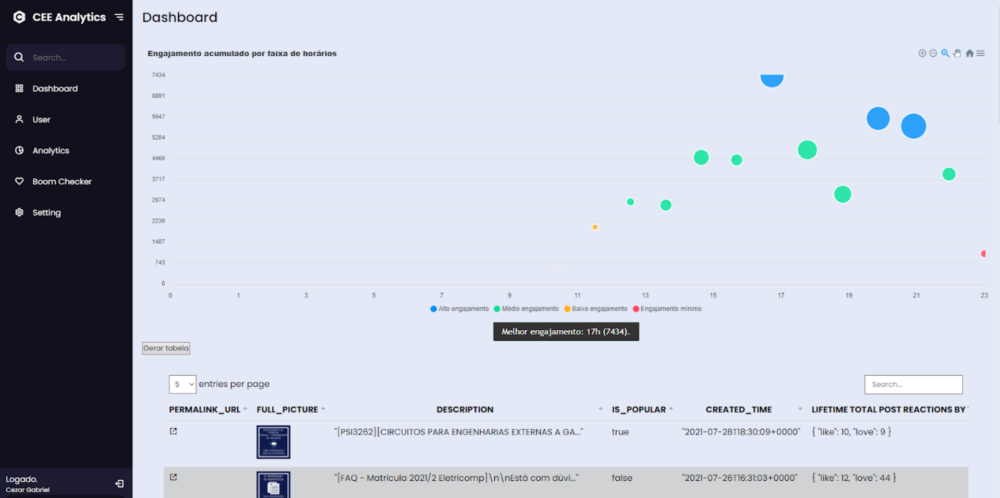
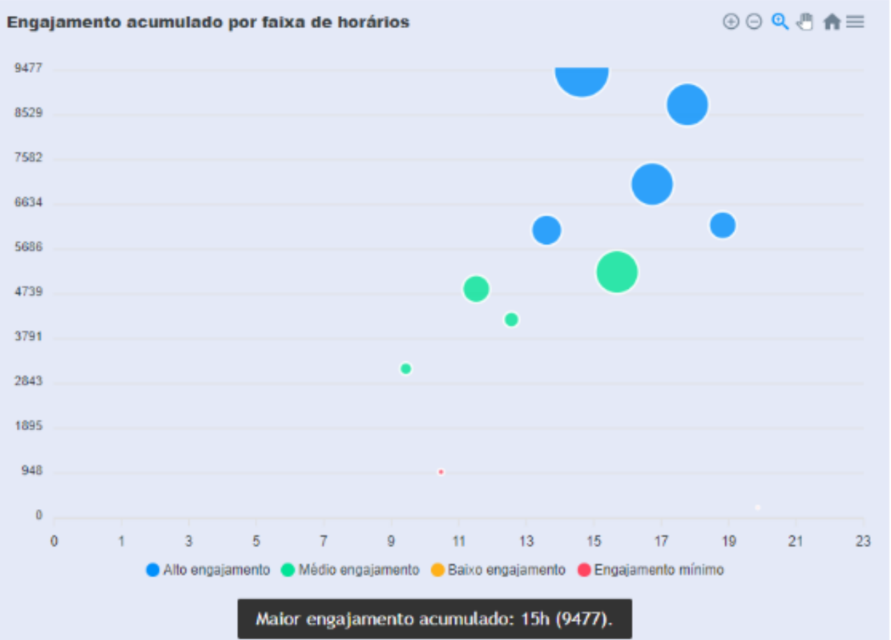

 
 <h2 align="center">CEE Analytics</h2>

  

    
    
     
     
    
    
    
    

## O que é?
CEE Analytics foi uma dashboard de métricas para a página do Facebook do Centro de Engenharia Elétrica e de Computação. Desenvolvi enquanto Diretor de Comunicações. O objetivo
era realizar estudos de quais eram os melhores horários para engajamentos na página, a fim de alcançar o maior número de pessoas.  
  
CEE Analytics conectava com a API do Facebook e, ao ser autorizado, coletava informações de alcance e interações das publicações, fornecendo um gráfico com os melhores horários para
se publicar na rede e uma tabela com todas as métricas de interesse. 

Com o passar dos meses, o centro acadêmico passou a dar mais ênfase ao Instagram, e o CEE Analytics caiu em desuso. Atualmente, não está funcional, pois não foi atualizado para novas versões
do Facebook. 

## Requerimentos e execução

Como o projeto está suspenso, a plataforma não funciona mais. 
Mas o acesso era realizado pela página no [Github Pages](https://cezargab.github.io/CEE-Analytics).

Entretanto, é possível atualizar para retomar o funcionamento, realizando um fork do projeto e restaurando o acesso à API.
Recomendo a utilização do [Gitpod](https://gitpod.io/workspaces) para isto, que permite a visualização em tempo real da página em edição.

## Screenshots

  

## Licença
Este repositório está licensiado pela [MIT License](LICENSE). 

